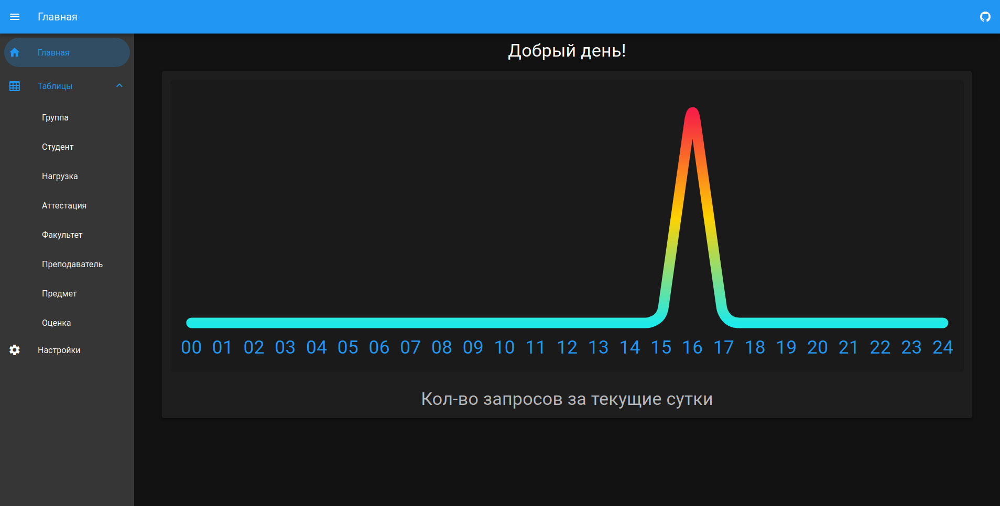
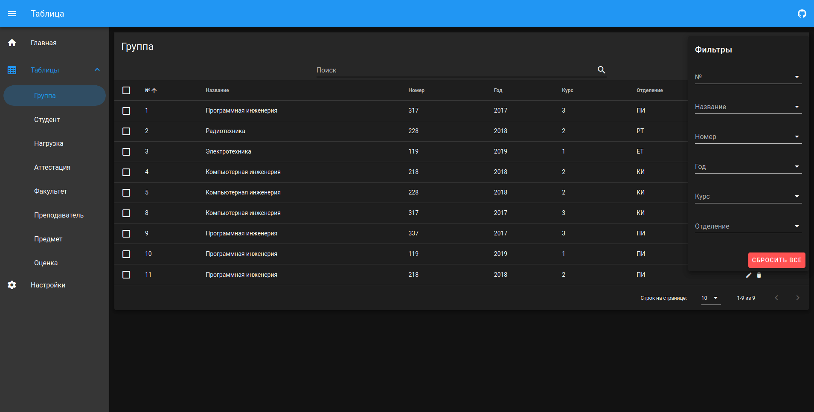

# uni-db

This is a basic project that helps managing university database. It is a course project so only Russian localization for now (I doubt I will add more).


[](https://github.com/yegorgunko/uni-db/issues)

[](assets/images/screenshots/1.png)
[](assets/images/screenshots/2.png)

## Table of Contents

- [Project setup](#project-setup)
- [Features](#features)
- [Tests](#tests)
- [License](#license)

## Project setup

### Clone

```bash
git clone git@github.com:yegorgunko/uni-db.git
```

### Install dependencies

```
yarn install
```

### Runs Express server with hot-reloads for development

```
yarn express
```

### Runs Express server for production

```
yarn express:run
```

### Compiles and hot-reloads for development

```
yarn serve
```

### Compiles and minifies for production

```
yarn build
```

### Lints and fixes files

```
yarn lint
```

### Customize configuration

See [Configuration Reference](https://cli.vuejs.org/config/).

## Features

- Modern UI and SPA support.
- Easy server management right beside the website source code ([`server/index.ts`](server/index.ts) file).
- Filter by any of the parameters.
- Convenient (I hope so) relational view.
- Export data to .CSV format.
- Dynamic pages (means if you add another table, [`Table.vue`](src/views/Table.vue) page will automatically get the data from it).
- Easy UI cutomization thanks to [`Vuetify`](https://vuetifyjs.com/) components.

## Tests

There are only HTTP requests to the server tests that are located inside the `tests` directory. Easily add the ones you need. For VSCode I recommend [REST Client](https://github.com/Huachao/vscode-restclient) extension.

## License

[](LICENSE)
